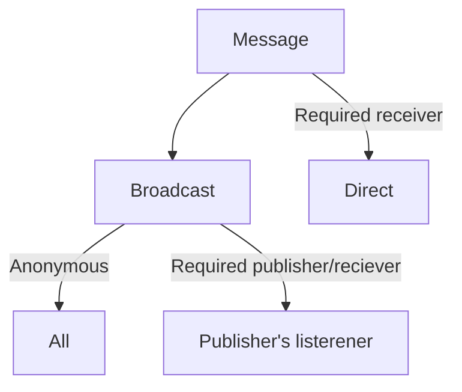

# Events mechanism

## Concepts

### Event sending graph



### Implementation Concept

#### Handler

`EventHandler` class

| Property | Type       | Description       |
|----------|------------|-------------------|
| Receiver | `Object`   | Listener instance |
| Handler  | `Consumer` | Handler instance  |

#### Binding Handlers

`EventTrigger` class

| Property  | Type           | Description                              |
|-----------|----------------|------------------------------------------|
| EventName | `String`       | Name of the cafeOldEvent                        |
| Handler   | `EventHandler` ||
| Publisher | `Object`       | Trigger only when publisher is specified |

#### Sending cafeOldEvent

---

Handler

| Paramater | Type     | Mandatory | Description                                        |
|-----------|----------|-----------|----------------------------------------------------|
| EventName | String   | Yes       |                                                    |
| Handler   | Consumer | Yes       | Action on EVENT                                    |
| Receiver  | Object   | Yes       | Is required to remove itself from listener map     |

Sending methods

| Method       | EventName | Message  | Receiver | Sender   | Description                                    |
|--------------|-----------|----------|----------|----------|------------------------------------------------|
| sendToAll()  | Required  | Optional | N/A      | N/A      | Sent to all listeners                          |
| sendTo()     | Required  | Optional | Required |          | Send EVENT only for RECEIVER                   |
| sendToMany() | Required  | Optional | N/A      | Required | Send EVENT to listener who listen given SENDER |

## Builder approach concept

```java
    // Creating Handler
    CafeEventHandler handler=CafeEventHandlerBuilder
            create(receiver)
            .for("eventName")
            .listen(sender)
            .execute(handler);

            CafeEventBus.registerHandler(handler);

            //Broadcast
            CafeEvent cafeOldEvent=CafeEventBuilder
            .create("eventName")
            .withBody(cafeOldEvent)

            // Direct sending
            CafeEvent cafeOldEvent=CafeEventBuilder
            .create("eventName")
            .withBody(cafeOldEvent)
            .to(Object sender)

            CafeEvent cafeOldEvent=CafeEventBuilder
            .create("eventName")
            .withBody(cafeOldEvent)
            .from(sender)

            CafeEventBus.send(cafeOldEvent);
```

    


